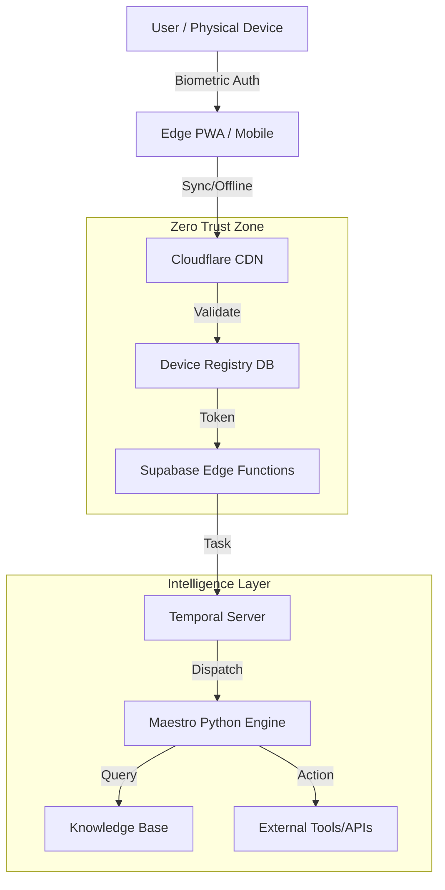

> **Current-state note (2026-07-04):** For branch/head/package/count facts, defer to `../CURRENT_PLATFORM_STATE_2026_07_04.md`. This executive summary is architecture context, not live-production certification.


<!-- APEX_DOC_STAMP: VERSION=v1.6.0 | LAST_UPDATED=2026-05-20 -->
# APEX-OmniHub Technical Architecture Specification

## Vercel Reference Classification

LEGACY — retained for historical/reference use; Cloudflare-first topology is canonical. Any Vercel commands, rollback paths, modules, or Edge Runtime references in this document are not current deployment proof unless separately labeled VERIFIED with active configuration evidence. See `docs/architecture/CANONICAL_TRUTH_MATRIX.md`.


**Document Owner:** CTO & Chief Platform Architect
**Last Updated:** 2026-05-20
**Status:** Production
**Version:** 1.6.0

---

## Executive Summary

APEX-OmniHub is a production-grade, **Cloudflare-first enterprise orchestration platform with Supabase, Temporal, and OmniLink integration layers**. It converges Web3 (Token-gating), Generative AI (Maestro), and **Physical Hardware Identity** into a unified control plane. This document reflects the "Unicorn-Class" architecture verified in the Feb 2026 audit.

**Core Value Proposition:**

- **Multi-skill AI orchestration** via Temporal.io workflows
- **Cyber-Physical Security** with Zero-Trust Device Registry & Biometrics
- **Edge-First Architecture** running locally on iOS/Android via Capacitor
- **Enterprise Resilience** with Chaos Engineering & Self-Healing (OmniSentry)
- **Edge Compute Layer** with deterministic LRU media cache and Cloudflare-first CORS proxy. Historical Vercel proxy references are LEGACY — retained for historical/reference use; Cloudflare-first topology is canonical.

---

## 1. Technology Stack (Actual Implementation)

### 1.1 Frontend Stack (The Hub)

| Layer              | Technology     | Version | Purpose                   |
| ------------------ | -------------- | ------- | ------------------------- |
| **Framework**      | React          | 18.3.1  | Component-based UI        |
| **Mobile Runtime** | Capacitor      | 6.0+    | Native iOS/Android Bridge |
| **State**          | TanStack Query | 5.83    | Offline-first sync engine |
| **UI**             | Shadcn UI      | Latest  | Accessible Design System  |
| **Web3**           | Wagmi + Viem   | 2.x     | Blockchain Identity       |

### 1.2 Physical AI Stack (The Senses)

| Component           | Implementation                     | Purpose                      |
| ------------------- | ---------------------------------- | ---------------------------- |
| **Device Registry** | `src/zero-trust/deviceRegistry.ts` | Hardware-level Allowlisting  |
| **Ears (Audio)**    | `src/utils/RealtimeAudio.ts`       | Real-time Voice Intelligence |
| **Identity**        | `src/lib/biometric-native.ts`      | Hardware Enclave Signing     |
| **Eyes (Vision)**   | `src/integrations/omniport`        | Multimodal Input Analysis    |

### 1.3 Edge Compute Stack (The Cache)

| Component              | Implementation                           | Purpose                           |
| ---------------------- | ---------------------------------------- | --------------------------------- |
| **Vercel Edge Proxy**  | `api/cors.ts`                            | LEGACY — retained for historical/reference use; Cloudflare-first topology is canonical. |
| **Cloudflare Worker**  | `edge/cors-proxy/edge-cors-proxy.js`     | CDN-level CORS proxy (stateless)  |
| **LRU Cache Governor** | `lib/media/EdgeCacheController.ts`       | 250 MB ceiling, localStorage ledger |
| **Lightweight Cache**  | `src/lib/media/EdgeCacheController.ts`   | Async prefetch + blob URL management |

### 1.4 Backend Stack (The Brain)

| Layer                    | Technology        | Purpose                                    |
| ------------------------ | ----------------- | ------------------------------------------ |
| **Temporal Worker**      | Python / Temporal | Durable workflow execution (`orchestrator/`) |
| **HTTP API + FSM**       | Python / FastAPI  | HTTP routes + deterministic FSM (`services/orchestrator/`) |
| **Resilience Protocol**  | Python / stdlib   | APEX Resilience Protocol — human-in-the-loop verification engine + approval dashboard (`omega/`); runs independently, not Temporal |
| **Engine**               | Temporal.io       | Durable Execution & Retries                |
| **Database**             | Supabase (PG)     | Relational Data & Edge Functions           |
| **Vector DB**            | Supabase pgvector | Semantic Memory (RAG)                      |

---

## 2. System Architecture Diagram



---

## 3. Directory Structure (Key Components)

```plaintext
/
├── apps/omnihub-site/        # The Control Surface (PWA)
│   ├── src/zero-trust/       # Device Registry Logic
│   ├── src/lib/biometric/    # Hardware Security Module
│   └── capacitor.config.ts   # Native Bridge Config
│
├── orchestrator/             # Temporal Worker (Python) — main.py worker lifecycle, server.py HTTP dispatch
│   ├── activities/           # Agent Capabilities
│   └── workflows/            # Durable Logic
│
├── services/orchestrator/    # FastAPI HTTP API + deterministic FSM (must not init Temporal Workers)
│
├── omega/                    # APEX Resilience Protocol — engine.py (human-in-the-loop verification) + dashboard.py (approval UI); runs independently
│
├── supabase/                 # The Data Layer
│   ├── migrations/           # SQL Schema (inc. device_registry)
│   └── functions/            # Edge Logic (Voice, Auth)
```

---

## Appendix A: Port & Service Reference

| Service        | Port/URL            | Purpose                |
| -------------- | ------------------- | ---------------------- |
| Frontend Dev   | localhost:8080      | Vite dev server        |
| Orchestrator   | localhost:8000      | FastAPI backend        |
| Temporal UI    | localhost:8233      | Workflow visualization |
| Realtime Audio | wss://api.openai... | Voice Stream (Proxied) |
| Local DB       | localhost:54322     | Supabase PostgreSQL    |

---

**Document Version:** 1.6.0
**Last Audit:** 2026-05-20
