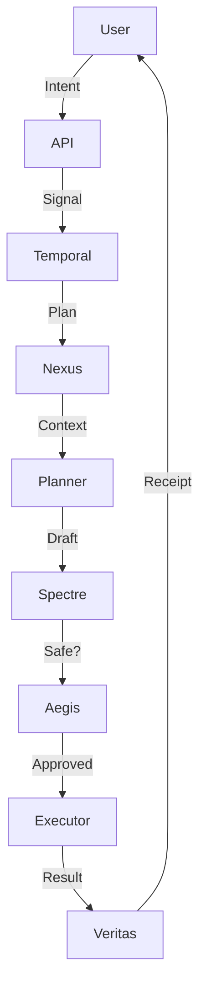

# APEX Orchestrator Architecture

**v2.2 - Unified Intelligence Grid**

## 🏗️ Core Modules

### 1. Nexus (Context)

The semantic memory layer.

- **Role**: Graph database interface.
- **Pattern**: RAG (Retrieval Augmented Generation).

### 2. Spectre (Simulation)

The prediction engine.

- **Role**: Runs "Shadow Workflows" to predict outcomes.
- **Usage**: Before executing a high-value transaction, Spectre simulates it in a forked state.

### 3. Aegis (Defense)

The immune system.

- **Role**: Real-time policy enforcement.
- **Feature**: "Blast Radius" calculation for every activity.

### 4. Chronos (Time)

The history keeper.

- **Role**: Event sourcing and replay.
- **Feature**: "Time Travel" debugging allows stepping back to any previous workflow state.

### 5. Veritas (Truth)

The verification layer.

- **Role**: Blockchain oracle and cryptographic proof generation.
- **Output**: verifiable receipts for all actions.

## 🔄 Data Flow

